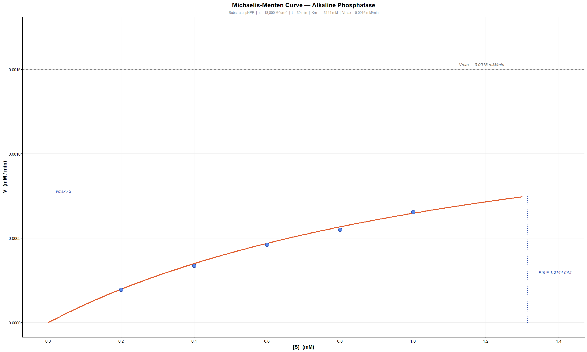
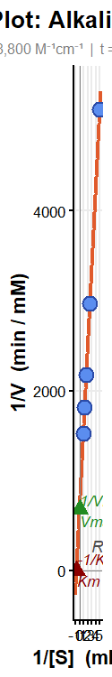
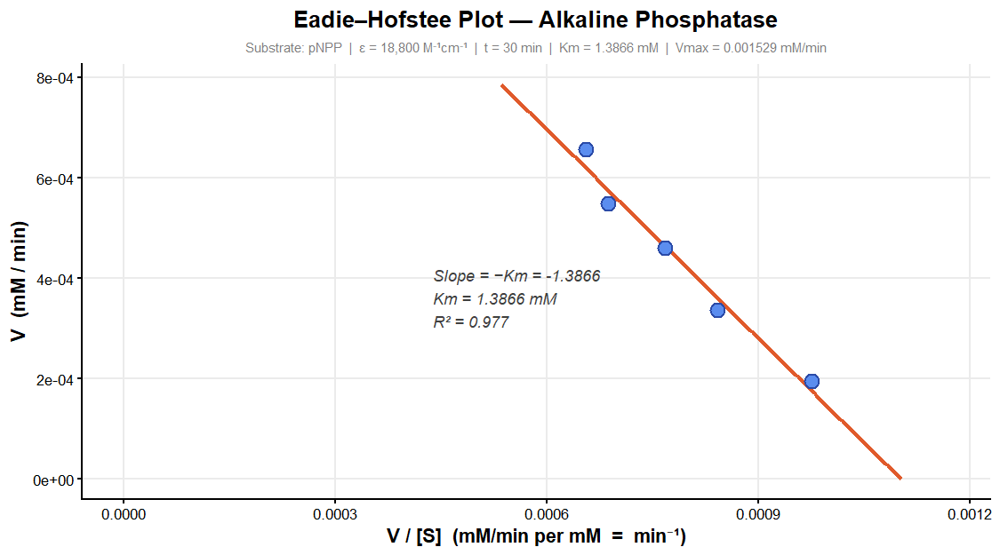

# Enzyme Kinetics Analysis — Alkaline Phosphatase (pNPP)

> R-based visualization pipeline for enzyme kinetics data using three classical methods: Michaelis-Menten, Lineweaver-Burk, and Eadie-Hofstee.

---

## Repository File

```
enzyme-kinetics/
│
├── README.md
└── Enzymekinetics_MM_lineweaverburq_eadiehofstee.R    # All 3 plots in one script
```

---

## Overview

This repository contains an R script to analyze and visualize the kinetics of **Alkaline Phosphatase** using **p-nitrophenyl phosphate (pNPP)** as substrate, detected spectrophotometrically at **405 nm** where the product p-nitrophenol (pNP) absorbs. Raw absorbance (OD) values are converted to velocity in **mM/min** using the Beer-Lambert Law, and three complementary kinetic plots are generated and discussed.

---

## Experimental Setup

| Parameter | Value |
|-----------|-------|
| Enzyme | Alkaline Phosphatase |
| Substrate | pNPP (p-nitrophenyl phosphate) |
| Detection wavelength | 405 nm |
| Molar extinction coefficient (ε) | 18,800 M⁻¹cm⁻¹ |
| Path length | 1 cm (standard cuvette) |
| Reaction time | 30 min *(update `reaction_time` in script as needed)* |

---

## Raw Data

### Substrate Concentration vs Absorbance

| [S] (mM) | OD (405 nm) |
|----------|-------------|
| 1.0 | 0.37 |
| 0.8 | 0.31 |
| 0.6 | 0.26 |
| 0.4 | 0.19 |
| 0.2 | 0.11 |

### Double-Reciprocal Values (Lineweaver-Burk)

| 1/[S] (mM⁻¹) | 1/OD |
|--------------|------|
| 1.00 | 2.70 |
| 1.25 | 3.22 |
| 1.67 | 3.85 |
| 2.50 | 5.26 |
| 5.00 | 9.09 |

---

## Beer-Lambert Conversion

Raw OD values are converted to reaction velocity using:

```
V (mM/min) = OD × 1000 / (ε × l × t)
```

For the double-reciprocal transformation:

```
1/V = (ε × l × t / 1000) × (1/OD)
```

---

## Plot 1 — Michaelis-Menten Curve

The Michaelis-Menten equation describes the hyperbolic relationship between substrate concentration and reaction velocity:

```
V = (Vmax × [S]) / (Km + [S])
```

### Why the MM Curve Alone is Insufficient

While the Michaelis-Menten plot provides an intuitive visualization of enzyme saturation kinetics, it **cannot be reliably used to manually determine Km** in this experiment. This is because all experimental substrate concentrations tested (0.2–1.0 mM) fall **below the derived Km of 1.3144 mM**, meaning the enzyme was operating entirely in the sub-saturating, first-order kinetic regime throughout the assay.

The curve never begins to flatten toward Vmax within the experimental range — the saturation plateau is never reached, and even **Vmax/2 was not experimentally achieved**. As a result, both Km and Vmax on the MM plot are purely **extrapolated values** derived from Lineweaver-Burk parameters, not directly read off the curve. Accurate manual estimation of Km from a hyperbolic MM curve requires substrate concentrations of at least **5–10× Km**, which would demand testing up to ~13 mM in this case. The use of graph paper for manual Km determination from the MM hyperbola is therefore not feasible here, and the analysis relies on the two linearization methods below.

### MM Plot Output




---

## Plot 2 — Lineweaver-Burk Plot

The Lineweaver-Burk (double-reciprocal) plot linearizes the Michaelis-Menten equation:

```
1/V = (Km/Vmax) × (1/[S]) + 1/Vmax
```

This allows Km and Vmax to be determined graphically even when saturation is never experimentally achieved, by extending the regression line to its intercepts:

- **Y-intercept** = 1/Vmax
- **X-intercept** = −1/Km
- **Slope** = Km/Vmax

**Linear regression** (`lm()` in R) is applied to the 1/V vs 1/[S] data points. The fitted line is extended beyond the axis boundaries so both intercepts are clearly visible and annotated on the plot, with the Y-intercept marked in green and the X-intercept in dark red.

### Regression Output

| Parameter | Value |
|-----------|-------|
| Vmax | 0.0015 mM/min |
| Km | 1.3144 mM |
| R² | 0.9993 |

### Lineweaver-Burk Plot Output




---

## Plot 3 — Eadie-Hofstee Plot

The Eadie-Hofstee plot rearranges the Michaelis-Menten equation as:

```
V = Vmax − Km × (V/[S])
```

Plotting **V vs V/[S]** gives a straight line where:

- **Y-intercept** = Vmax
- **Slope** = −Km

**Linear regression** is independently applied to the Eadie-Hofstee transformed data, re-deriving Km and Vmax as a cross-validation of the Lineweaver-Burk results. All regression parameters (slope, intercept, R²) are annotated directly on the plot and printed to the RStudio console. This method is statistically less biased than the Lineweaver-Burk because it does not compress low-[S] data points to the extreme end of the axis via double-reciprocal transformation.

### Eadie-Hofstee Plot Output




---

## Kinetic Parameters Summary

| Method | Km (mM) | Vmax (mM/min) | R² |
|--------|---------|----------------|-----|
| Lineweaver-Burk | 1.3144 | 0.0015 | 0.9993 |
| Michaelis-Menten | 1.3144 | 0.0015 | — (theoretical, from LB) |
| Eadie-Hofstee | *see console output* | *see console output* | *see console output* |

---

## Why Does Km Vary Across the Three Methods?

All three plots use the same raw dataset but transform it mathematically in different ways before fitting a regression line. This changes which data points carry the most statistical weight in the final parameter estimates.

**Lineweaver-Burk** takes reciprocals of both axes, massively amplifying measurement error at low substrate concentrations. The 0.2 mM point becomes 1/[S] = 5, sitting far from the cluster of other points and pulling the regression line disproportionately. Since Km is read from the x-intercept, it is highly sensitive to this leverage effect.

**Eadie-Hofstee** spreads error more evenly since neither axis is a double reciprocal. However, because V appears on both axes simultaneously, errors in V are correlated across x and y, introducing its own form of regression bias in a different direction.

**Michaelis-Menten** inherits whatever error already exists in the Lineweaver-Burk parameters since the theoretical curve is drawn from those values directly rather than independently fitted to the raw data.

The variation in Km is therefore not a flaw — it is a well-documented consequence of the statistical properties of each linearization method. The true Km lies within the range defined by all three estimates.

---

## Dependencies

```r
install.packages("ggplot2")
```

Only `ggplot2` is required. All other functions (`lm`, `coef`, `seq`) are from base R.

---

## How to Use

1. Clone or download this repository
2. Open `Enzymekinetics_MM_lineweaverburq_eadiehofstee.R` in **RStudio**
3. Update the reaction time at the top of the script:
## Source Code

The complete analysis script can be found here:
 [Enzymekinetics_MM_lineweaverburq_eadiehofstee.R](Enzymekinetics_MM_lineweaverburq_eadiehofstee.R)

```r
reaction_time <- 30   # Replace with your actual assay incubation time in minutes
```

4. Run the entire script — all three plots and console parameter outputs generate automatically
5. Export plots from RStudio and save them into a `/screenshots` folder in the repo
6. The image placeholders in this README will render automatically once screenshots are added

---

## Notes

- ε = 18,800 M⁻¹cm⁻¹ is the accepted standard molar extinction coefficient for pNP at 405 nm
- The MM curve is **theoretical** — drawn using LB-derived parameters — and is included for visualization and conceptual understanding only
- Km and Vmax should be cited from **Lineweaver-Burk** as the primary method, with **Eadie-Hofstee** as cross-validation
- To experimentally approach Vmax, substrate concentrations of at least **~13 mM (10× Km)** would be needed in future assays

---

## License

MIT License — free to use and modify for academic and research purposes.

## Author
 
**Arunabha Pal**
BSc Microbiology
_St. Xavier's College (Autonomous) Kolkata_
